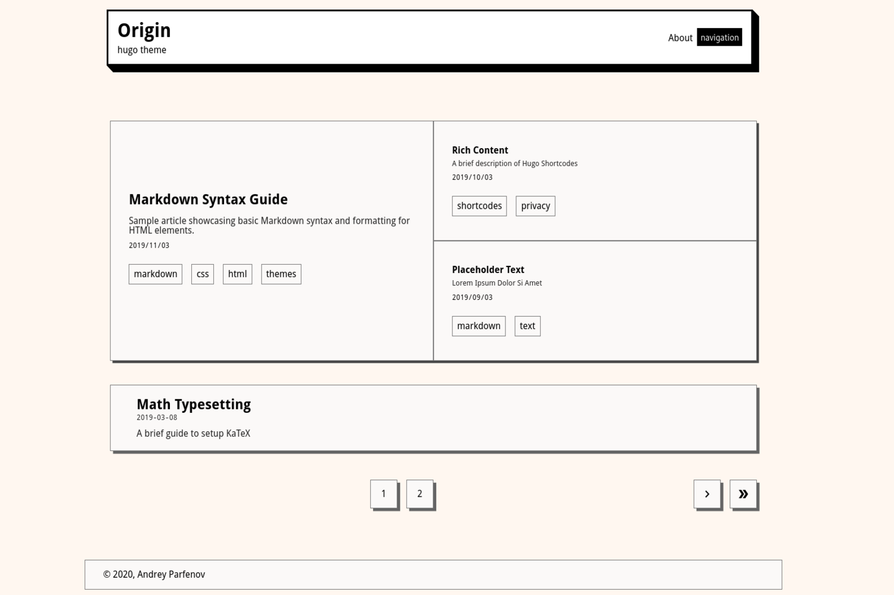

# ORIGIN HUGO THEME

simple hugo theme for blogging

[demo](https://asleeppiano.gitlab.io/origin-hugo-site/)



# Installation

1. Create a new site

```sh
hugo new site myblog
```

2. Add a theme

```sh
cd myblog
git init
git submodule add https://gitlab.com/asleeppiano/origin-hugo-theme.git themes/origin
```

# Featured posts

You can replace homescreen grid with default post list items.

edit config.toml

```toml
[params]
  featured = false
```

# JS

If you want to disable js, set cssonly parameter to true.

```toml
[params]
  cssonly = true
```

# Favicon

add favicon with name "favicon-32.png" to static folder.
